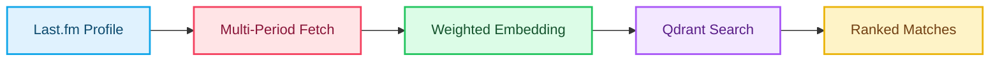
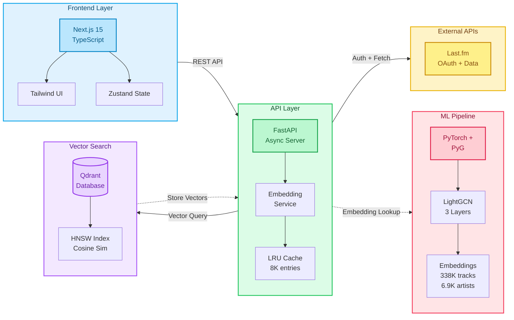
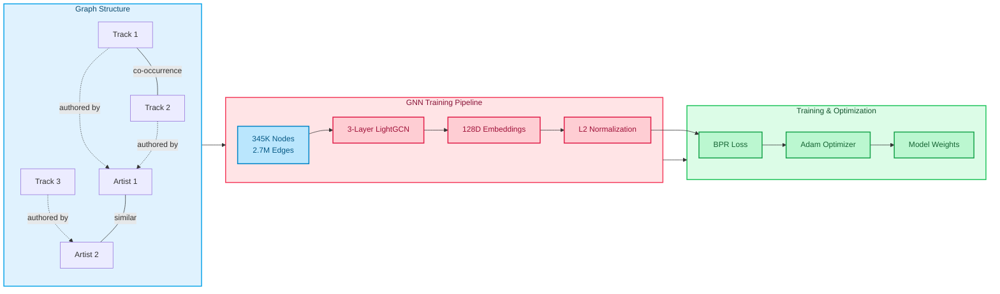

<div align="center">

<!-- Add your banner image here -->


**AI-Powered Music Compatibility Matching**

[](https://choosealicense.com/licenses/mit/) [](https://www.python.org/downloads/) [](https://nextjs.org/) [](https://fastapi.tiangolo.com/) [](https://pytorch.org/)

*Find your musical soulmate using Graph Neural Networks and vector similarity search*

[Demo](https://vibematch-sigma.vercel.app) • [Docs](#) • [Report Bug](#) • [Request Feature](#)

</div>

---

## What is VibeMatch?

VibeMatch connects users with similar music taste by analyzing their listening patterns through deep learning. Unlike traditional systems that compare artist lists, VibeMatch captures **complex musical relationships** through a Graph Neural Network trained on millions of music interactions.

**Key Innovation:** We don't just match artists you both like—we understand the *musical relationships* between artists to find truly compatible taste profiles.

## Key Features

- **Deep Music Understanding**: Graph Neural Network analyzes 338K+ tracks and 6.9K+ artists to learn musical relationships
- **Instant Matching**: Sub-10ms vector search across user profiles using Qdrant
- **Multi-temporal Analysis**: Combines long-term preferences with recent listening trends
- **Cold Start Solution**: Synthetic profiles ensure immediate matches for new users
- **Privacy-First**: Only uses public Last.fm data, GDPR compliant

## Screenshots

<div align="center">


</div>

## How It Works



**Step-by-step:**

1. **Authentication**: Connect your Last.fm account via OAuth
2. **Data Fetching**: Retrieve listening history across multiple time periods (all-time, 6mo, 3mo, recent)
3. **Embedding Generation**: Your music taste is encoded into a 128D vector using the trained GNN (~500ms)
4. **Vector Search**: Qdrant finds top-K compatible users via cosine similarity (<10ms)
5. **Results**: View matches with compatibility scores and shared artists

## System Architecture



### Machine Learning

**LightGCN (Light Graph Convolutional Network)**



**Model Specs:**
- **Embeddings**: 128 dimensions, L2 normalized
- **Architecture**: 3-layer graph convolution
- **Training**: Bayesian Personalized Ranking (BPR) loss
- **Performance**: Recall@10: 0.64, Precision: 1.00
- **Graph**: 345K nodes (338K tracks, 6.9K artists), 2.7M edges

**Model Specs:**
- **Embeddings**: 128 dimensions, L2 normalized
- **Architecture**: 3-layer graph convolution
- **Training**: Bayesian Personalized Ranking (BPR) loss
- **Performance**: Recall@10: 0.64, Precision: 1.00
- **Graph**: 345K nodes (338K tracks, 6.9K artists), 2.7M edges

### Tech Stack

<table>
<tr>
<td width="50%">

**Frontend**
- Next.js 15 (App Router, RSC)
- TypeScript (strict mode)
- Tailwind CSS
- Zustand (state management)
- Deployed on Vercel

</td>
<td width="50%">

**Backend**
- FastAPI (async REST API)
- PyTorch + PyTorch Geometric
- Qdrant (vector database)
- LRU cache (8K entries)
- DigitalOcean App Platform

</td>
</tr>
</table>

## Performance

| Metric | Value |
|--------|-------|
| Embedding Generation | ~500ms |
| Vector Search | <10ms |
| End-to-End Latency | <800ms |
| Model Size | ~168MB |
| User Embedding Coverage | ~95% (exact + fuzzy + zero-shot) |

## Dataset

Built from Last.fm data:
- **Source**: Last.fm augmented dataset with artist similarity graph
- **Tracks**: 338,046 Last.fm tracks
- **Artists**: 6,899 unique artists
- **Relationships**: 2.7M edges (track-artist, track-track, artist-artist)
- **Genre coverage**: 95.9% of tracks have genre assignments

Coverage breakdown for user embeddings:
- Exact matches: ~60%
- Fuzzy matches: ~25%
- Zero-shot inference: ~10%
- Missing: <5%

## User Embedding Strategy

## User Embedding Strategy

**Multi-temporal weighted average with consistency boosting:**

```mermaid
graph LR
    subgraph Sources["Data Sources"]
        direction TB
        A1[Overall<br/>45%]
        A2[6 Months<br/>25%]
        A3[3 Months<br/>15%]
        A4[Recent 200<br/>15%]
    end

    subgraph Lookup["Lookup Strategy"]
        direction TB
        B1[Exact Match<br/>O1 - 60%]
        B2[Fuzzy FAISS<br/>~25%]
        B3[Zero-Shot<br/>~10%]
        B4[LRU Cache<br/>8K entries]
    end

    subgraph Weighting["Weighting Pipeline"]
        direction TB
        C1[Consistency Boost<br/>Multi-period × 1.4]
        C2[Temporal Decay<br/>0.5^days/30]
        C3[Playcount Weight<br/>log1p]
    end

    subgraph Output["Output"]
        direction TB
        D[128D Normalized<br/>User Vector]
    end

    Sources --> Lookup
    Lookup --> Weighting
    Weighting --> Output
    B4 -.->|Cache Hit| B1

    style Sources fill:#e0f2fe,stroke:#0ea5e9,stroke-width:2px,color:#0c4a6e
    style Lookup fill:#ffe4e6,stroke:#f43f5e,stroke-width:2px,color:#881337
    style Weighting fill:#dcfce7,stroke:#22c55e,stroke-width:2px,color:#14532d
    style Output fill:#f3e8ff,stroke:#a855f7,stroke-width:2px,color:#581c87
    
    style A1 fill:#bae6fd,stroke:#0284c7,stroke-width:2px,color:#075985
    style A2 fill:#bae6fd,stroke:#0284c7,stroke-width:2px,color:#075985
    style A3 fill:#bae6fd,stroke:#0284c7,stroke-width:2px,color:#075985
    style A4 fill:#bae6fd,stroke:#0284c7,stroke-width:2px,color:#075985
    style B1 fill:#fecdd3,stroke:#e11d48,stroke-width:2px,color:#9f1239
    style B2 fill:#fecdd3,stroke:#e11d48,stroke-width:2px,color:#9f1239
    style B3 fill:#fecdd3,stroke:#e11d48,stroke-width:2px,color:#9f1239
    style B4 fill:#fecdd3,stroke:#e11d48,stroke-width:2px,color:#9f1239
    style C1 fill:#bbf7d0,stroke:#16a34a,stroke-width:2px,color:#166534
    style C2 fill:#bbf7d0,stroke:#16a34a,stroke-width:2px,color:#166534
    style C3 fill:#bbf7d0,stroke:#16a34a,stroke-width:2px,color:#166534
    style D fill:#e9d5ff,stroke:#9333ea,stroke-width:2px,color:#6b21a8
```



**Fallback Hierarchy:**
1. **Exact match** → Precomputed embedding (O(1)) - ~60% coverage
2. **Fuzzy match** → FAISS similarity search - ~25% coverage
3. **Zero-shot** → Weighted average of similar artists - ~10% coverage
4. **LRU Cache** → 8K entries, ~75% hit rate


**Fallback Hierarchy:**
1. **Exact match** → Precomputed embedding (O(1)) - ~60% coverage
2. **Fuzzy match** → FAISS similarity search - ~25% coverage
3. **Zero-shot** → Weighted average of similar artists - ~10% coverage
4. **LRU Cache** → 8K entries, ~75% hit rate

## Scientific Foundation

Graph Neural Networks combine collaborative filtering with content-based features and relational structure. Each GNN layer aggregates neighbor information:

```
e_i^(k+1) = Σ(neighbors) [1/√(degree_i × degree_j)] × e_j^(k)
```

Final embedding averages all layers (local + global context).

**References**
- He et al. (2020) - "LightGCN: Simplifying and Powering Graph Convolution Network for Recommendation"
- Rendle et al. (2009) - "BPR: Bayesian Personalized Ranking from Implicit Feedback"

## Privacy & Compliance

- Only public Last.fm API data
- No scraping, respects rate limits
- OAuth 1.0, no password storage
- Anonymous embeddings (non-reversible)
- GDPR compliant with right to deletion

## License

MIT License
